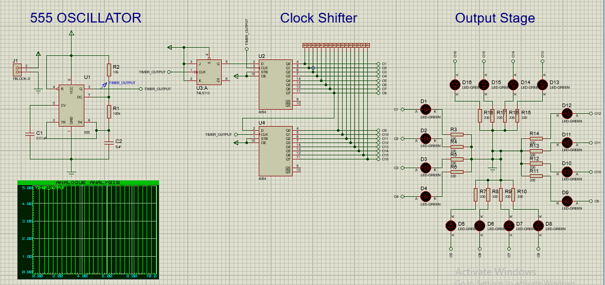
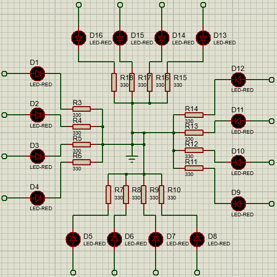

# Assignment Task

In the assignment task, you are to implement a similar PCB design as shown in the workshop session. The starter file has been provided. You can run the simulation and see what the circuit does.

## Circuit Schematics and Working Principle

<figure align="center">
    
    <figcaption>Decade counter</figcaption>
</figure>

The circuit has a 555 timer circuit like before. The timer is used as a clock in a JK flip flop and a shift register. On each clock cycle, alternating (1/0) is fed into the shift register. The shift register drives the final output stage where 16 LEDs are connected. These LEDs are arrange in almost a circular fashion, giving the effect of a circulating light pattern.

<figure align="center">
    
    <figcaption>Decade counter</figcaption>
</figure>

## Design Criteria

- Design the PCB so that the LEDs look pretty on the PCB. Try to implement the circular pattern of the LEDs on the PCB. Place the other components as necessary.

- Be sure to add a board edge so that the 3D visualizer shows the circuit board also, not just floating components!

- Be sure to include all the components from the schematics into the PCB design.

- You are not allowed to add/remove components from the schematics, just create the PCB from the ISIS Tab.

- Judgment will be done on factors such as (1) Components placement (2) Circuit appearance (3) Clean traces (4) Circuit compactness (5) Zero design errors

- You can add your initials on the circuit if you like :D

## Submission

- After completing the design, simply save the project properly. Then go to <a href="https://forms.gle/bEbCqKbmde4jzn99A">this google form link</a>. In the **Submission File** field, upload the **Assignment Circuit.pdsprj** file only. Please do not add anything else.

- Submit the google form to finish the assignment :D